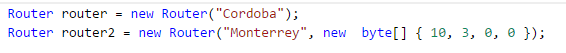
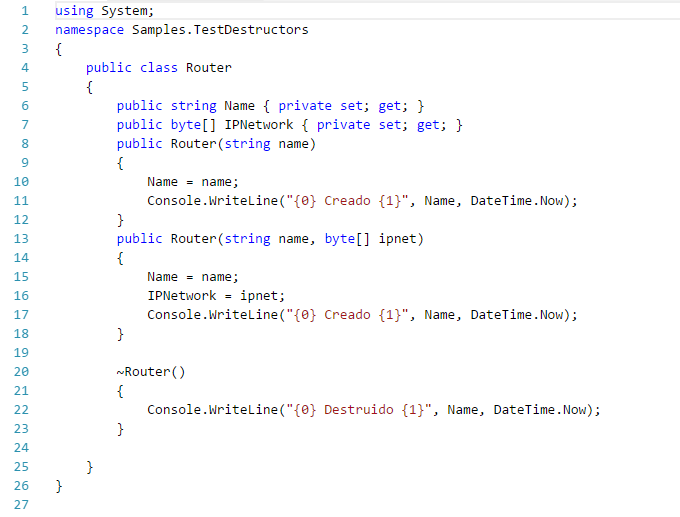
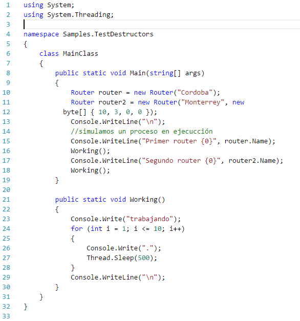
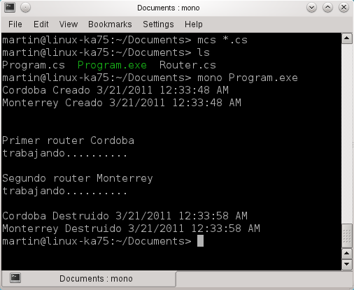

# Uso de Destructores en C#

En lenguajes orientados a objetos como C#,C++ o Java los objetos tienen un ciclo de vida el cual inicia cuando se crea el objeto mediante un constructor y acaba cuando se termina el objeto mediante un destructor.
Por ejemplo con la palabra reservada new, llamamos al constructor de un
objeto del tipo router:

El uso de constructores es igual en C# como lo es en C++ y Java, donde sino especificamos el constructor, el compilador se encarga de crearlo ya que una de sus responsabilidades es la llamada a un constructor el cual como un estándar tomado de C++ el constructor tiene el mismo nombre que la clase.
De igual forma la clase puede tener el constructor predeterminado sin argumentos, como un constructor personalizado, por ejemplo en el siguiente código:

En C# a diferencia de C++ existe el Garbage Collector (recolector de basura) que se encarga de destruir los objetos que fueron creados y ya no son utilizados, por lo que el programador no es responsable de liberar recursos asignando un destructor a cada objeto.

Sin embargo hay casos en C# donde los destructores son necesarios para objetos que hacen uso de recursos no administrados (unmanaged resources) como las conexiones hacia las bases de datos o el uso de archivos.
Los destructores a diferencia de los constructores no se heredan, no pueden recibir parámetros y no pueden sobrescribirse.
La sintaxis de un destructor es con el mismo nombre que el constructor solo se agrega una ~ como prefijo, como se muestra en el siguiente código:

A continuación el programa principal para ejemplificar los destructores

En este ejemplo el código dentro del destructor imprime un mensaje en la consola lo cual es algo trivial, esto es importante ya que en la mayoría de la documentación que hablan acerca de destructores en C# señalan que deben usarse con extremo cuidado.Hay ciertas reglas acerca de su uso:

1.Se debe tener presente es nunca utilizar destructores en managed code (código manejado) ya que representa un problema de desempeño para el garbage collector, ya que a diferencia de C++ el objeto no es destruido inmediatamente cuando es ejecutado el destructor.

2.En lugar de destructores utilizar Close() o Dispose().

3.NUNCA poner código en el destructor que realice cambios críticos al ambiente o bien código que utilice recursos, es decir los destructores se usaron para liberar no para utilizar.

4.No se debe hacer referencia a otros objetos dentro del destructor.

5.Nunca llames a un constructor de forma directa, el garbage collector
lo invoca de forma automática, si se requiere liberar recursos de forma
determinística lo recomendable es usar la interfaz IDisposable.

Es posible invocar y controlar el Garbage Collector vía los métodos estáticos de la clase System.GC, pero no es recomendable ya que se activa para todas las aplicaciones que utilicen recursos en ese momento no únicamente para la aplicación que lo invoco, además que debemos de conocer los métodos no determinísticos para la liberación de memoria.
A continuación la salida del programa

